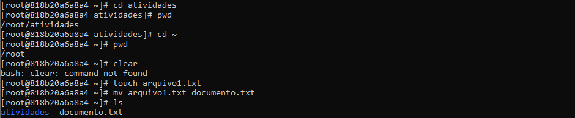
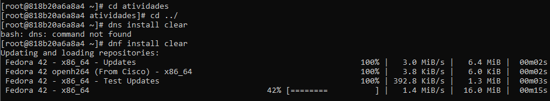
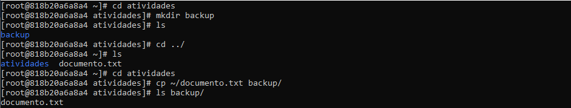
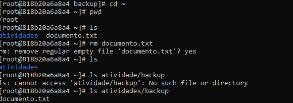
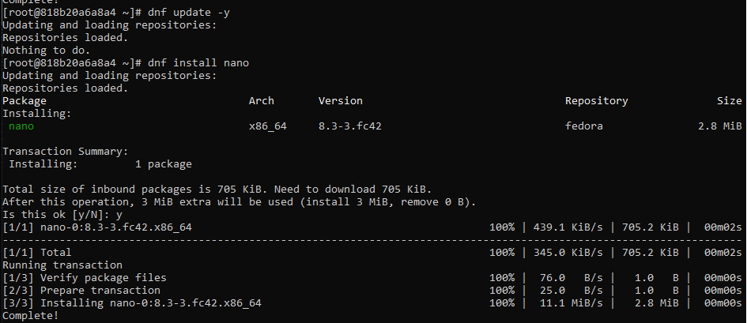
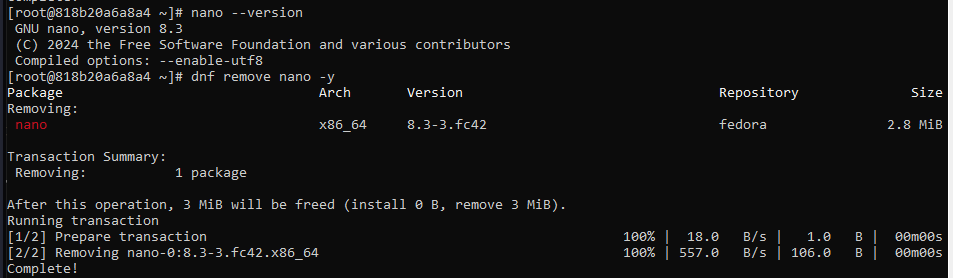
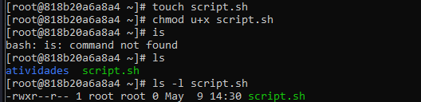
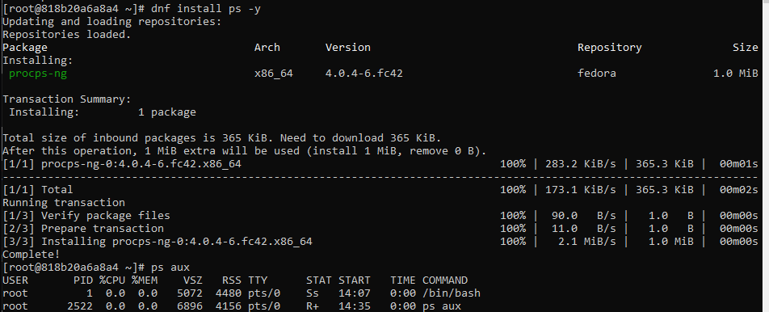
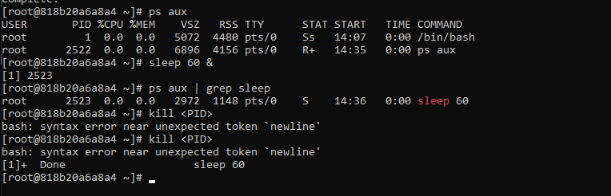
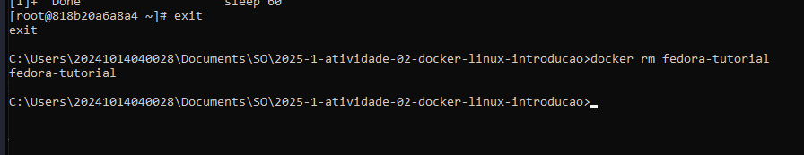

# Relatório da Atividade de Introdução ao Linux Utilizando Docker no Windows

**Nome**: Isabella Camilli Meletani
**Data**: 02/05/2025

---

## 1. Introdução
Este relatório apresenta as atividades práticas, focadas na utilização do sistema operacional Linux em um ambiente virtualizado por meio de contêiner Docker. A prática foi desenvolvida utilizando uma imagem Fedora, proporcionando um ambiente isolado para a execução dos comandos básicos do Linux.

O principal objetivo desta etapa foi familiarizar os alunos com o uso de comandos essenciais do sistema dentro de um contêiner, explorando conceitos fundamentais de administração de sistemas, manipulação de arquivos e gerenciamento de processos. Além disso, o exercício visou consolidar a compreensão sobre o funcionamento e a aplicação prática de contêiner.

Ao longo da atividade, foram executados diversos comandos e tarefas, documentados por meio de capturas de tela, as quais compõem o corpo deste relatório, demonstrando a execução e o resultado das operações realizadas.

---

## 2. Relato

#### 2.1 Navegando entre os arquivos

Inicialmente, foi criado um contêiner contendo os recursos necessários para a realização do exercício. Em seguida, foram executados os seguintes comandos, na ordem apresentada:

- **pwd**  
  Mostra o caminho completo (path) do diretório atual.

- **cd**  
  Muda o diretório atual.

- **ls**  
  Lista os arquivos e diretórios do diretório atual.

- **mkdir**  
  Cria um novo diretório.

- **df**  
  Mostra informações sobre o uso de espaço em disco dos sistemas de arquivos montados.

Após a execução dos comandos, foi criada uma pasta denominada atividades, e realizou-se a navegação entre os diretórios a fim de observar os resultados retornados por cada comando.

#### 2.2 Manipulando arquivos

Na sequência, foram utilizados os seguintes comandos:

- **touch**
  Cria um novo arquivo vazio.

- **mv**
  Move ou renomeia arquivos e diretórios.

Durante esta etapa da prática, foi realizada uma tentativa de utilização do comando clear. No entanto, o comando não pôde ser executado corretamente, possivelmente devido à ausência de sua instalação no ambiente. Após a tentativa sem sucesso, prosseguiu-se com a criação do arquivo arquivo1.txt utilizando o comando touch. Em seguida, o nome do arquivo foi alterado para documento.txt por meio do comando mv.

Durante esta etapa, foi identificada a necessidade de instalar determinados comandos que não estavam previamente disponíveis no ambiente. Como exemplo, o comando clear foi instalado por meio do gerenciador de pacotes **dnf**

Posteriormente, acessou-se o diretório atividades e foi criado um novo diretório denominado backup. Em seguida, foi utilizado o comando:

- **cp**
  Realiza a cópia de arquivos ou diretórios de um local para outro.

Após a execução do comando cp, foi realizada a verificação para confirmar o sucesso da operação, observando se o arquivo 'documento.txt' foi devidamente copiado para o diretório de destino. 

Em seguida, navegou-se até o diretório pessoal e confirmou-se o caminho e os arquivos presentes com os comandos apropriados.
Posteriormente, o arquivo que havia sido copiado anteriormente foi removido utilizando o comando **rm**, que é responsável pela exclusão de arquivos no sistema.
Por fim, foi feita a verificação da ausência do arquivo no diretório original, confirmando o sucesso da operação realizada com o comando rm.

#### 2.3 Mais comandos

A seguir, foi realizado o download e a remoção do pacote **nano**, um editor de texto leve e fácil de usar no terminal. O nano é utilizado para edição rápida de arquivos de texto em ambientes Linux, oferecendo várias funcionalidades básicas que o torna ideal para usuários iniciantes e para edição de arquivos de configuração do sistema.

Posteriormente realizei os comandos:
- **chmod u+x**
  Concede permissão de execução ao usuário (dono) do arquivo.
- **ls -l**
  Exibe informações detalhadas de um arquivo, incluindo permissões, proprietário, tamanho e data de modificação.

Foi criado um novo arquivo chamado "script.sh". Após a criação, foram atribuídas permissões de execução ao usuário por meio do comando adequado. Por fim, foi feita a verificação das permissões e atributos do arquivo utilizando um comando que exibe informações detalhadas, confirmando a modificação aplicada.

Foi realizado o download do comando **ps**, utilizado para exibir informações sobre os processos em execução no sistema. Ele permite visualizar detalhes como o identificador do processo (PID), terminal associado, uso de CPU e o comando que originou o processo, sendo uma ferramenta útil para monitoramento e diagnóstico.

Em seguida foram realizados os seguintes comandos:
- **ps aux**
  Lista todos os processos em execução, com informações detalhadas sobre cada um (usuário, PID, uso de CPU/memória, status, comando, etc.).

- **sleep 60 &**
  Inicia um processo em segundo plano que aguarda por 60 segundos.

- **ps aux | grep sleep**
  Filtra os processos listados para exibir apenas aqueles relacionados ao comando sleep.

- **kill <PID>**
  Encerra o processo com o número de identificação (PID) informado.

#### 2.4 Saida do conteiner

Para finalizar a prática, foi utilizado o comando apropriado para sair do contêiner. Em seguida, procedeu-se com a remoção do contêiner Docker utilizado durante as atividades, encerrando completamente o ambiente de trabalho.

## 3. Conclusão

A prática permitiu o desenvolvimento de habilidades básicas na utilização do terminal Linux, incluindo criação, navegação, manipulação de arquivos, execução e controle de processos. Foi possível compreender o funcionamento de comandos fundamentais e a importância de um ambiente controlado, como o contêiner Docker, para testes e aprendizado. Como dificuldade, destacou-se a ausência de mensagens de retorno em certos comandos, o que inicialmente gerou dúvidas quanto ao sucesso das operações. Essa falta de feedback explícito exigiu atenção redobrada e a verificação manual dos resultados, contribuindo para o entendimento mais aprofundado do comportamento do terminal.
